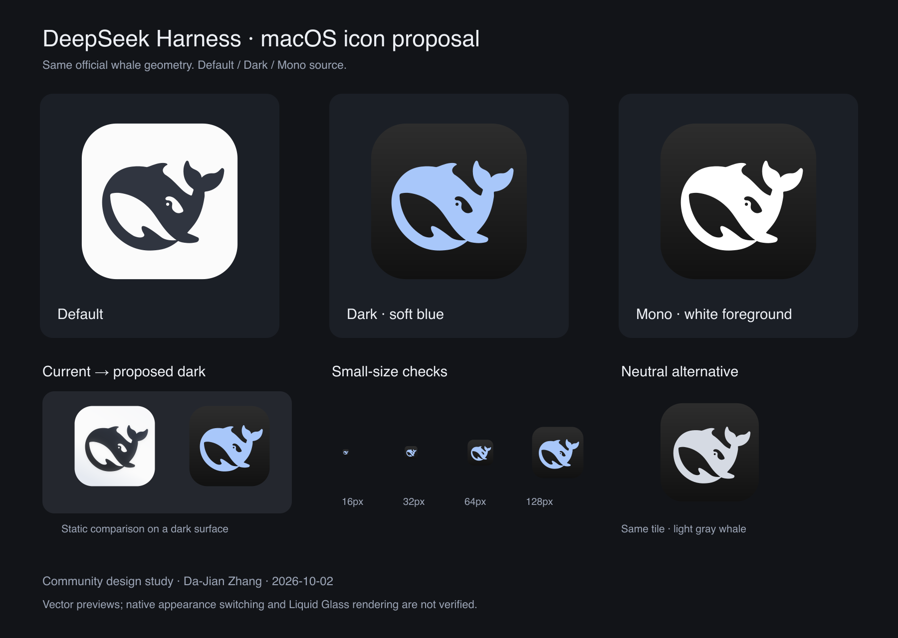

# DeepSeek Harness macOS icon proposal

A community design proposal by Da-Jian Zhang, prepared with AI assistance on 2026-10-02 for [official Discussion #7892](https://github.com/deepseek-ai/deepseek-harness/discussions/7892).

The current macOS icon has a bright tile that stands out in a dark Dock. This proposal keeps the official whale shape and explores a lower-luminance dark appearance. The preview is a static design comparison, not a screenshot of an installed or system-rendered icon.

## Design

| Variant | Background | Whale | Purpose |
| --- | --- | --- | --- |
| Default | `#FBFBFB` | `#303540` | Simplified flat interpretation of the current light icon |
| Dark, preferred | `#2D2D2D` → `#111111` | `#A8C7FA` | Charcoal tile with a soft blue whale |
| Dark, neutral alternative | Same charcoal gradient | `#D5DAE3` | Option closer to the current monochrome identity |
| Mono source | Transparent | White alpha silhouette | Source for native clear/tinted appearance authoring |

All variants retain the same upstream SVG path, orientation, negative spaces, and relative composition. The preferred dark version introduces a soft blue treatment; it is a proposed color choice, not a claim about the current official palette. No glow, bevel, specular highlight, blur, or drop shadow is baked into the proposed source artwork. The gradient is a design choice and can be replaced by Icon Composer's system background.

## Files

- `fallback/`: 1024 × 1024 SVG/PNG previews with the existing inset rounded-square footprint. Default, dark, and neutral dark variants are supplied separately. These static files cannot select an appearance by themselves.
- `sizes/`: 16, 32, 64, 128, 256, and 512 pixel exports rendered directly from each vector source.
- `layers/`: 1024 × 1024, full-canvas, transparent foreground SVG/PNG files and separate full-canvas background files. Import these into Icon Composer rather than the already rounded fallback composites; let the native pipeline apply the platform mask and effects. The mono foreground is a source layer, not a completed system Mono icon.
- `reference/`: the upstream macOS SVG and PNG for comparison, with the upstream MIT license retained in `LICENSE`.
- `verification.json`: path identity checks and verification limits.

## Integration suggestion and limits

Apple's [app icon guidance](https://developer.apple.com/design/human-interface-guidelines/app-icons) and [Icon Composer documentation](https://developer.apple.com/documentation/xcode/creating-your-app-icon-using-icon-composer) describe appearance variants and separate artwork layers. Use the provided layers as a starting point to author and validate a native appearance-aware icon. System icon appearance selection is distinct from the app's internal dark UI setting. Prefer the system icon appearance selection where the packaging pipeline supports it.

This package does not contain a compiled asset catalog, a native `.icon` document, an Electron patch, or a signed application build. Replacing a PNG or `.icns` alone does not establish automatic switching or native clear/tinted rendering. Electron packaging, supported macOS versions, signing/notarization, Finder/About/Dock consistency, and appearance transitions require validation by the desktop maintainers.

Visually reviewed the static comparison and 16/32/64/128-pixel previews. The whale remains recognizable at small sizes, while the eye and fine negative spaces lose detail at 16 pixels; native optical-size refinement may still help. The vector `d` string is identical to the upstream path in each fallback and foreground variant. PNG sizes and transparency were checked. No native runtime behavior has been tested.

## Source and attribution

Upstream source: [`apps/desktop/resources/icon-macos.svg`](https://github.com/deepseek-ai/deepseek-harness/blob/639ed015397290b3745d163aafe02ffee4aa3f84/apps/desktop/resources/icon-macos.svg), snapshot commit `639ed015397290b3745d163aafe02ffee4aa3f84`.

The original artwork is from DeepSeek Harness, copyright (c) 2026 DeepSeek, provided under its MIT license. The upstream license is included. The recoloring, source-layer separation, and presentation are community modifications. This proposal is not endorsed by DeepSeek or Apple, and no transfer of trademark rights is implied. The exploratory AI raster concept shown in the chat is not used in these deliverable assets; the deliverables use the exact upstream vector path.
